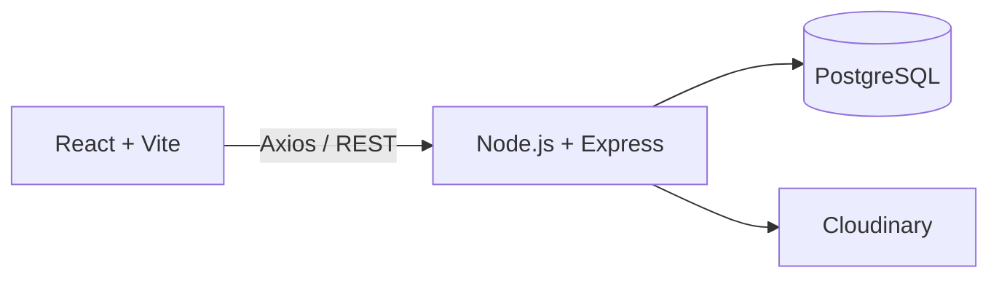

# Kuvia — Comércio Local

> Plataforma full-stack que permite a pequenos negócios moçambicanos criar uma loja online e apresentar os seus produtos na internet.


## Sobre o projeto

A **Kuvia** é uma plataforma de criação de lojas online orientada ao comércio local. Cada vendedor pode criar uma loja, adicionar produtos e partilhar a sua presença digital com clientes.

O objetivo é reduzir a barreira de entrada de pequenos comerciantes no comércio eletrónico, oferecendo uma solução simples para gerir a loja e divulgar produtos.

## Funcionalidades implementadas

- Registo e autenticação com JWT.
- Perfis de **Cliente**, **Vendedor** e **Administrador**.
- Criação e gestão de lojas.
- Cadastro de produtos com imagens no Cloudinary.
- Pesquisa e filtros de produtos por categoria.
- Painel do vendedor com informações da loja.
- Área administrativa para validação e moderação de produtos.
- Interface responsiva para computador e dispositivos móveis.
- Endpoint de saúde da API em `/api/health`.

## Arquitetura



| Camada | Tecnologias |
|---|---|
| Frontend | React, Vite, React Router, Tailwind CSS, Axios |
| Backend | Node.js, Express, JWT, Express Validator |
| Dados | PostgreSQL, Sequelize |
| Imagens | Multer, Cloudinary |

## Estrutura do repositório

```text
Mercado_Kuvia/
├── kuvia-backend/     # API REST, modelos e regras de negócio
├── kuvia-frontend/    # Interface React
└── README.md
```

## Executar localmente

### 1. Backend

```bash
cd kuvia-backend
cp .env.example .env
npm install
npm run dev
```

Edite o `.env` com a ligação PostgreSQL, a chave JWT, o endereço do frontend e as credenciais do Cloudinary.

### 2. Frontend

```bash
cd kuvia-frontend
cp .env.example .env
npm install
npm run dev
```

Por padrão, o frontend fica em `http://localhost:5173` e a API em `http://localhost:8080`.

## Decisões técnicas

- Separação entre frontend e backend no mesmo repositório.
- Autorização baseada em papéis para limitar ações por tipo de utilizador.
- PostgreSQL como base de dados relacional e Sequelize como ORM.
- Cloudinary para armazenamento persistente de imagens.
- CORS configurável através de variáveis de ambiente.

## Próximos passos

- Adicionar testes automatizados no backend e frontend.
- Concluir o fluxo de pedidos e pagamentos móveis.
- Implementar favoritos e mensagens entre clientes e vendedores.
- Acrescentar documentação completa dos endpoints da API.

## Autor

Desenvolvido por [Rosário Pompilio Caravela](https://github.com/rosariocaravela), estudante de Engenharia Informática em Maputo, Moçambique.

